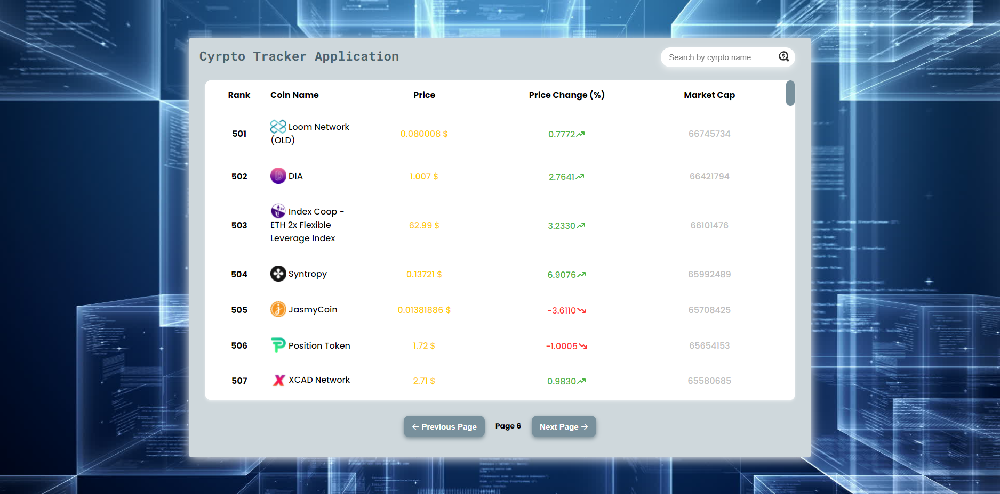
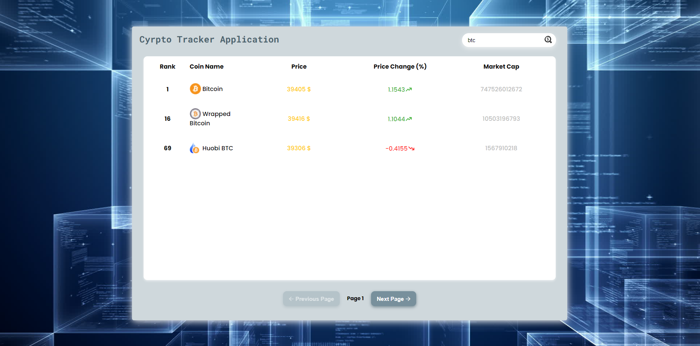

# Dada Crypto Application

## In this React application, we will be able to track the price of cryptocurrency finance and search for the cryptocurrency we want.

- In this application, I used the Redux library and the Redux Toolkit toolset.
- Data is pulled from API. In the first request, 100 coin data comes. Afterwards, it is possible to switch to other pages.
- When you click on the table titles, the data is sorted according to the clicked title.

### [Application link (click me)](https://dadacrypto.netlify.app/)

---

